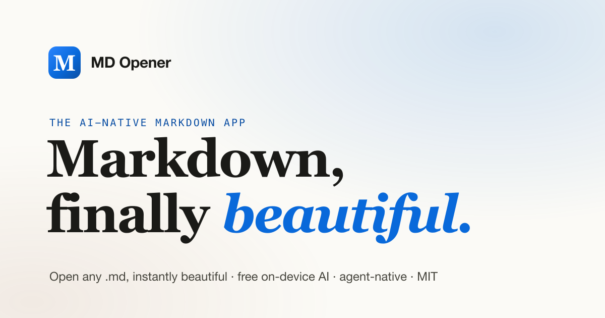

<div align="center">


# MD Opener

### Markdown, finally beautiful.

**An open-source, AI-native Markdown app for macOS.** Double-click any `.md` and
it's instantly beautiful — read it, edit it, export it, and understand it with
free, private, **on-device AI** built in.

*Think Preview.app, but Markdown-aware, editable, and AI-native.*

[](https://github.com/ashlrai/md-opener/actions/workflows/ci.yml)
[](./LICENSE)
[](#)
[](https://tauri.app)

[**Download**](https://github.com/ashlrai/md-opener/releases) ·
[Website](https://github.com/ashlrai/md-opener) ·
[Contributing](./CONTRIBUTING.md) ·
[Vision](./docs/VISION.md)



</div>

---

## Why

Your AI agents write Markdown all day — `README.md`, `PLAN.md`, research dumps.
On macOS those open in **Preview** (a blank page) or **TextEdit** (raw syntax).
No app owns the simple job of making them *look right* instantly, especially for
non-technical people. MD Opener does exactly that, and nothing you don't need.

## Features

- **Instant, beautiful rendering** — GFM, Shiki-highlighted code, Mermaid
  diagrams, KaTeX math, tables, footnotes.
- **Edit without the syntax** — Typora-style WYSIWYG (Milkdown) + a lossless
  source mode (CodeMirror). Atomic save, external-change aware.
- **Export anywhere** — one-click **PDF / DOCX / HTML**, fully offline, no Pandoc.
- **Free, private, on-device AI** — summarize / explain / rewrite / translate via
  **Apple Foundation Models** (macOS 26+), falling back to local **Ollama** or
  your own key. Nothing leaves your device unless you opt in.
- **Agent-native** — `mdopen file.md`, the `mdopener://` URL scheme, and an **MCP
  server** so Claude Code / Codex can open, read, edit, and export the live doc.
- **Smart agent output** — callouts, interactive checkboxes that save back to the
  file, and automatic plan / diff / multi-file detection.
- **Three themes** — Paper, Sepia, Midnight — switch live.
- **Native & instant** — built on [Tauri 2](https://tauri.app); a tiny binary, no
  Electron bloat. MIT, local-first, no telemetry.

## Use it with an AI agent

```bash
# Open a file from any terminal or agent:
mdopen notes.md
open "mdopener://open?path=$PWD/notes.md"

# Let Claude Code drive the app (open / read / edit / export the current doc):
claude mcp add mdopener /path/to/mdopener-mcp
```

## Develop

Prerequisites: [Rust](https://rustup.rs), [Bun](https://bun.sh), and Xcode
Command Line Tools (macOS).

```bash
bun install
bun run tauri dev        # hot-reloading desktop app
bun run tauri dev -- file.md   # open a file on launch
```

Quality gates (all green in CI):

```bash
bun run typecheck        # tsc --noEmit
bunx biome check src     # lint + format
bun run test             # Vitest unit tests
cargo check --workspace --manifest-path src-tauri/Cargo.toml
```

The on-device AI sidecar (optional, macOS 26+) builds separately:

```bash
cd src-tauri/bins/mdopener-afm && ./build.sh
```

## Architecture

| Layer | What |
|---|---|
| `src/` | React 19 + TS frontend — renderer (remark/rehype + Shiki/Mermaid/KaTeX), Milkdown & CodeMirror editors, AI sidebar, export, Zustand stores |
| `src-tauri/src/` | Rust core — file I/O, watcher, deep links, AI proxy (reqwest), loopback IPC, on-device AI bridge |
| `src-tauri/bins/` | `mdopen` CLI · `mdopener-mcp` MCP server · `mdopener-afm` Swift on-device AI sidecar |
| `landing/` | The marketing site (static, deploy-anywhere) |

See [`docs/VISION.md`](./docs/VISION.md) for the north star and
[`docs/RELEASING.md`](./docs/RELEASING.md) for the release process.

## Contributing

Contributions welcome! Please read [CONTRIBUTING.md](./CONTRIBUTING.md). The
short version: local-first, no GPL in the bundle, and verify in the real app.

## License

[MIT](./LICENSE) © MD Opener contributors
