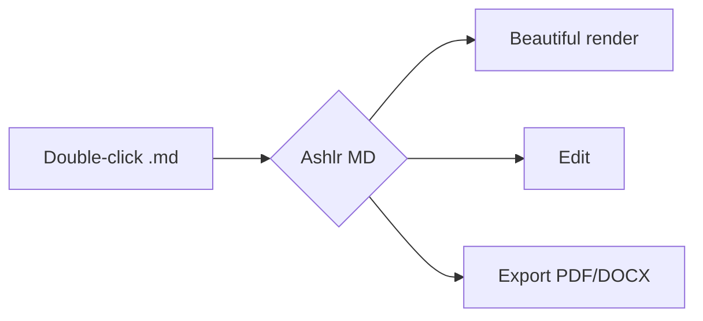

# Ashlr MD Showcase

A single document that exercises every renderer feature. If this all looks
great, **M1 works**.

## Text & inline formatting

This paragraph has **bold**, *italic*, ~~strikethrough~~, `inline code`, and a
[link to Tauri](https://tauri.app). Here is some ==highlighted== text and a
footnote reference.[^1]

> **Note:** Blockquotes should have a clean accent border and muted text.
> They can span multiple lines and contain `code` too.

## Lists

- Top-level bullet
  - Nested bullet
  - Another nested item
- Back to top level

1. First ordered item
2. Second ordered item
3. Third ordered item

### Task list

- [x] Scaffold the project
- [x] Build the renderer
- [ ] Ship M1
- [ ] Add the editor

## Code with syntax highlighting

```typescript
interface MarkdownFile {
  path: string;
  content: string;
}

async function open(path: string): Promise<MarkdownFile> {
  const content = await readFile(path);
  return { path, content };
}
```

```python
def fibonacci(n: int) -> int:
    a, b = 0, 1
    for _ in range(n):
        a, b = b, a + b
    return a
```

```bash
# macOS (Homebrew cask — coming soon)
brew install --cask md-opener

# All platforms: download from GitHub Releases
mdopen ./README.md
```

## Table

| Feature      | Status | Notes                          |
| ------------ | :----: | ------------------------------ |
| Rendering    |   ✅   | remark + rehype                |
| Code blocks  |   ✅   | Shiki, dual-theme              |
| Diagrams     |   ✅   | Mermaid                        |
| Math         |   ✅   | KaTeX                          |
| Editing      |   🚧   | Milkdown (M2)                  |

## Math

Inline math like $E = mc^2$ should render, and so should a display block:

$$
\int_{-\infty}^{\infty} e^{-x^2}\, dx = \sqrt{\pi}
$$

## Mermaid diagram



## Image


---

That's everything. Switch themes with the toolbar button — code, diagrams, and
chrome should all follow along.

[^1]: Footnotes are part of GitHub-Flavored Markdown.
